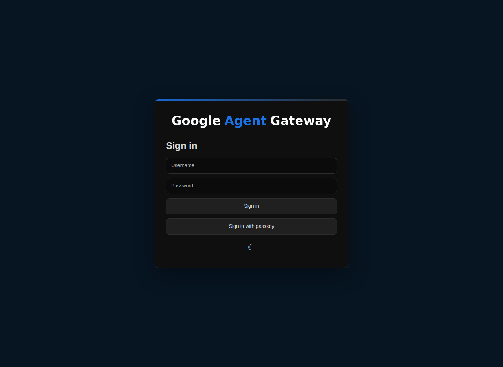
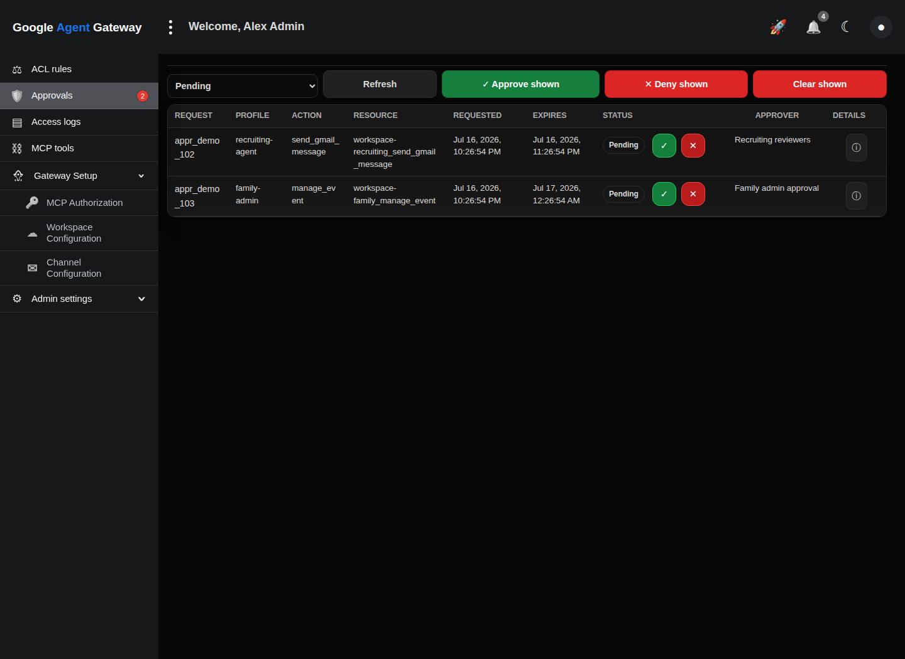
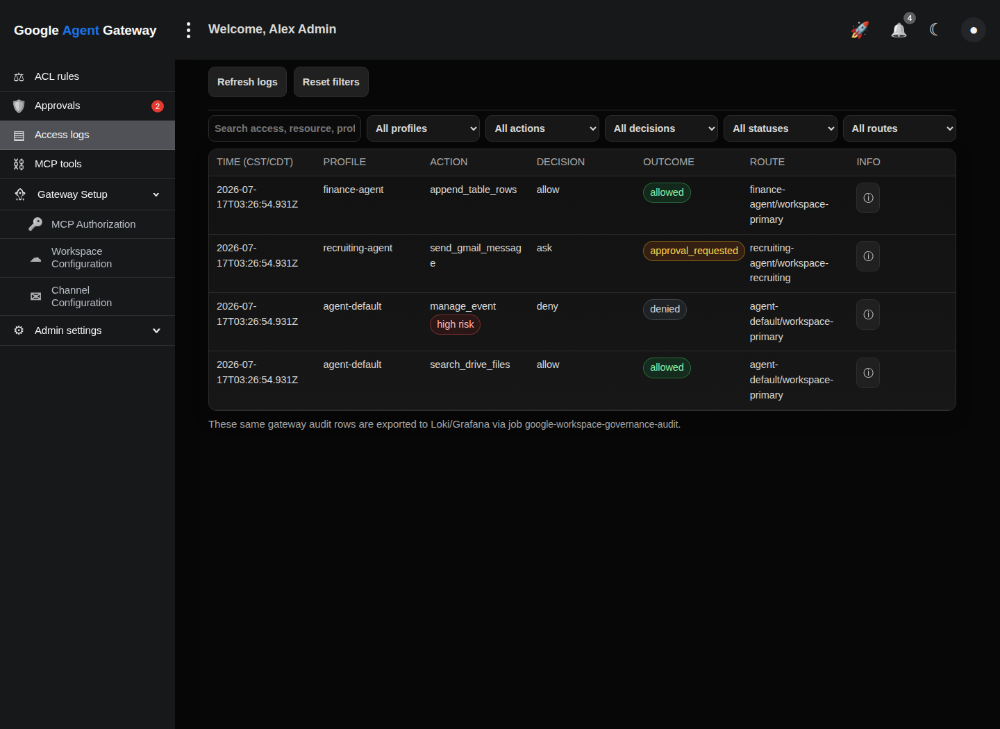
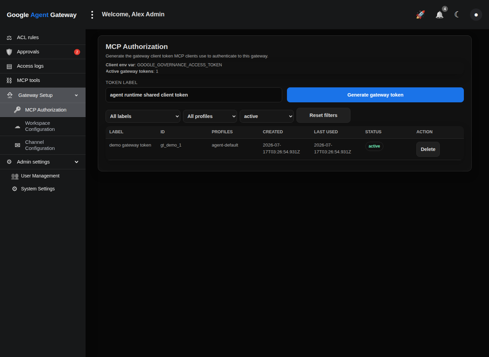
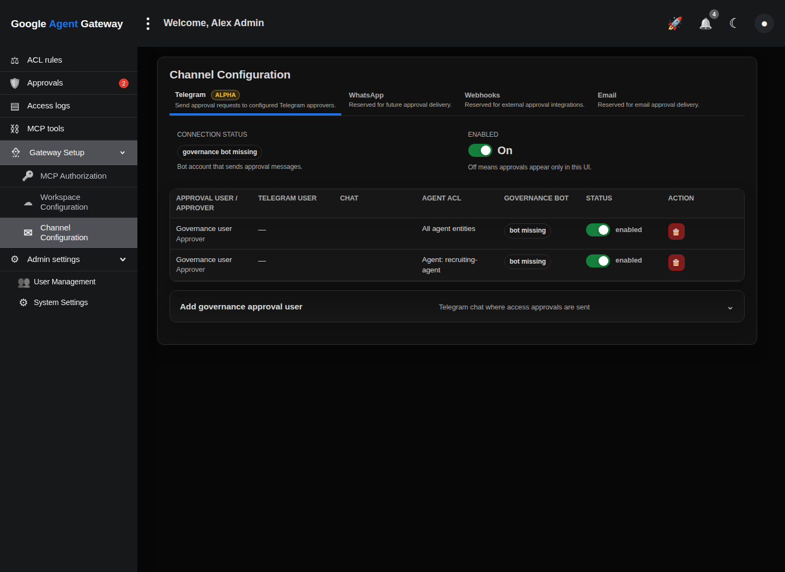
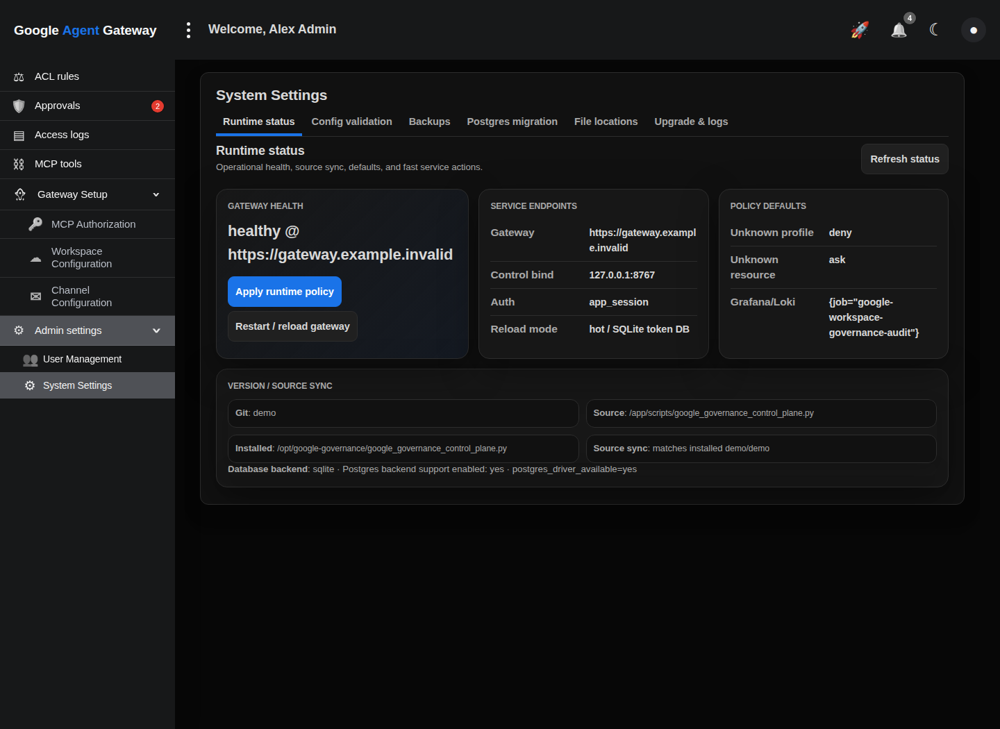

# Control UI Screenshots

These screenshots are generated from the inert static demo. They use the real control-plane UI shell and navigation with mock data only.

  <a href="https://governance-gateway-demo.pages.dev/" target="_blank" rel="noopener noreferrer">Open the live demo</a>
  &nbsp;·&nbsp;
  <a href="../README.md" target="_blank" rel="noopener noreferrer">Back to README</a>

## Login

## ACL rules

## Approvals

## Access logs

## MCP tools

## Gateway Setup — MCP Authorization

## Gateway Setup — Workspace Configuration

## Gateway Setup — Channel Configuration

## Admin Settings — Runtime Status

## Admin Settings — Runtime Backups

